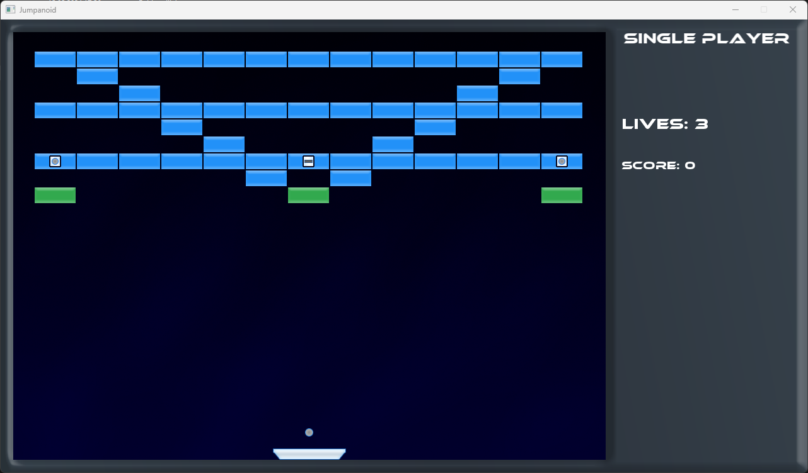

# Jumpanoid

Jumpanoid is an arcade game created as a university project.

The game combines Arkanoid/Breakout-style brick breaking with platform movement. The goal is to bounce the ball, destroy bricks across consecutive levels, and score points. Jumpanoid includes Single Player, Cooperation, and Versus modes.

## Controls

- Menu: mouse and left mouse button.
- Player 1: `A` / `D` - move left and right, `W` - jump and launch the ball.
- Player 2: `Left Arrow` / `Right Arrow` - move left and right, `Up Arrow` - jump and launch the ball.
- `Escape` - pause and resume the game.

## Font Credits

This project uses third-party fonts. The font files remain the property of their respective creators and foundries; review the original license terms before redistributing the game package or using the fonts elsewhere.

- `Ethnocentric` (`fonts/ethnocentric.otf`) - designed by Ray Larabie and published by [Typodermic Fonts](https://typodermicfonts.com/). Typodermic's current license information is available on the [Typodermic Fonts license page](https://typodermicfonts.com/license/).
- `Perfect Dark (BRK)` (`fonts/pdark.ttf`) - created by Brian Kent / AEnigma Fonts. A license reference for AEnigma Fonts is available in the [Debian legal archive](https://lists.debian.org/debian-legal/2002/08/msg00323.html), and the local font metadata also identifies AEnigma Fonts as the copyright holder.

# License

This project is licensed under the MIT License. See the `LICENSE` file for details.
